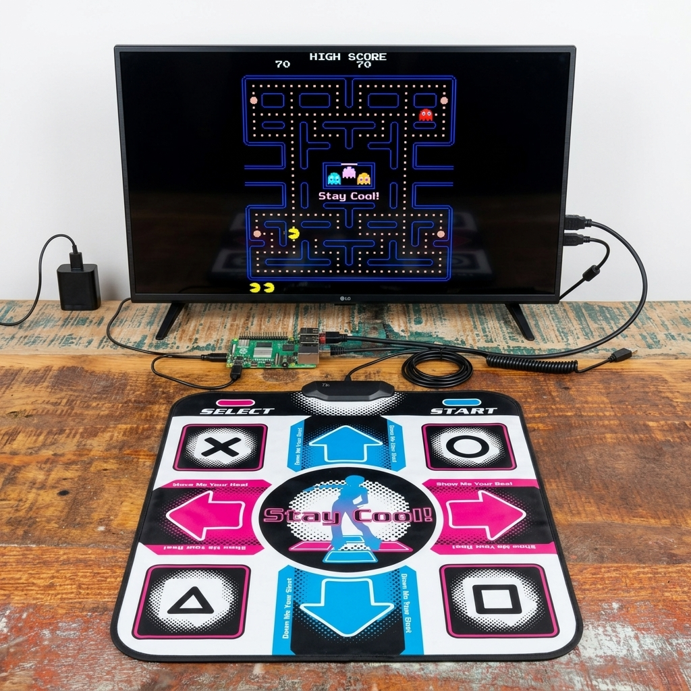

# Games Remade in Python

A Python-based game engine designed for running interactive games on a Raspberry Pi using USB HID (Human Interface Device) controllers.

### Key Highlights

- **Target Hardware:** Runs directly on a Raspberry Pi using USB HID inputs.
- **Primary Input:** Optimized for live play with Dance Dance Revolution (DDR) dance pads.
- **Initial Release:** Features **Pacman** as the inaugural playable game.

### Adding a game

The cabinet is a platform, and installing a title is dropping a folder into
[`python-version/games/`](./python-version/games/) — no shared file is edited.

- **The contract:** [`cabinet/game.py`](./python-version/cabinet/game.py) — `Game`, `GameSpec`, `GameContext`
- **The guide:** [Adding a game](./python-version/README.md#adding-a-game), and [Designing for the mat](./python-version/README.md#designing-for-the-mat) for what a DDR pad can actually do
- **A skeleton to copy:** [`game_template.py`](./.claude/skills/new-game/reference/game_template.py)
- **In Claude Code:** `/new-game`
